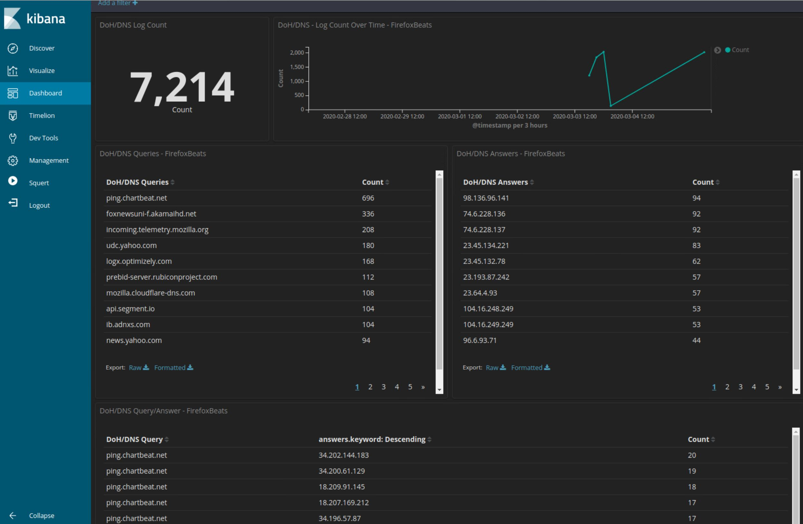

# Firefox-DoH-SO
Integrating Firefox host logs into Security Onion for DoH query/answer visibility

This was tested using WIN10 with Filebeat 7.6.0 and Security Onion 16.04.6.4

# Configure Firefox:
1. On your Windows 10 Client, create a folder at "C:\FirefoxLogs\"
2. Enable logging using the instructions at https://developer.mozilla.org/en-US/docs/Mozilla/Debugging/HTTP_logging
 - These config files work with the log file set to "C:\FirefoxLogs\log"
 - To reduce log size, it is recommended to ONLY enable logging modules "timestamp,sync,nsHostResolver:5"
 
# On Security Onion:
1. Download Firefox-DoH-SO/SecurityOnion/6800_firefoxbeat.conf and place it in the /etc/logstash/custom/ directory
2. Issue "sudo so-allow" choosing the beats option
3. Following so-allow prompts, give Security Onion the IP address/range that you expect to recieve beats from
4. Run "sudo so-restart"

# On Windows10:
1. Install Filebeat
2. Replace filebeat.yml with the one posted at Firefox-DoH-SO/Windows/filebeat.yml
3. Within filebeat.yml, replace the IP address under "Logstash Output" with your SO address - Save file
4. Run filebeat
  - Either install as a service or run manually
  - To run manually, issue ".\filebeat.exe -e" from within the filebeat directory

# Visualize:
Once Security Onion is recieving beats and indexing objects, you can create visualizations and dashboards as you see fit. Some examples are ready to be imported at Firefox-DoH-SO/SecuriyOnion/Visualizations. If you just want to import all of them including the Dashboard, just use Firefox-DoH-SO/SecurityOnion/Dashboards/Dashboard_with_Visualizations. This is what the Dashboard should look like:

